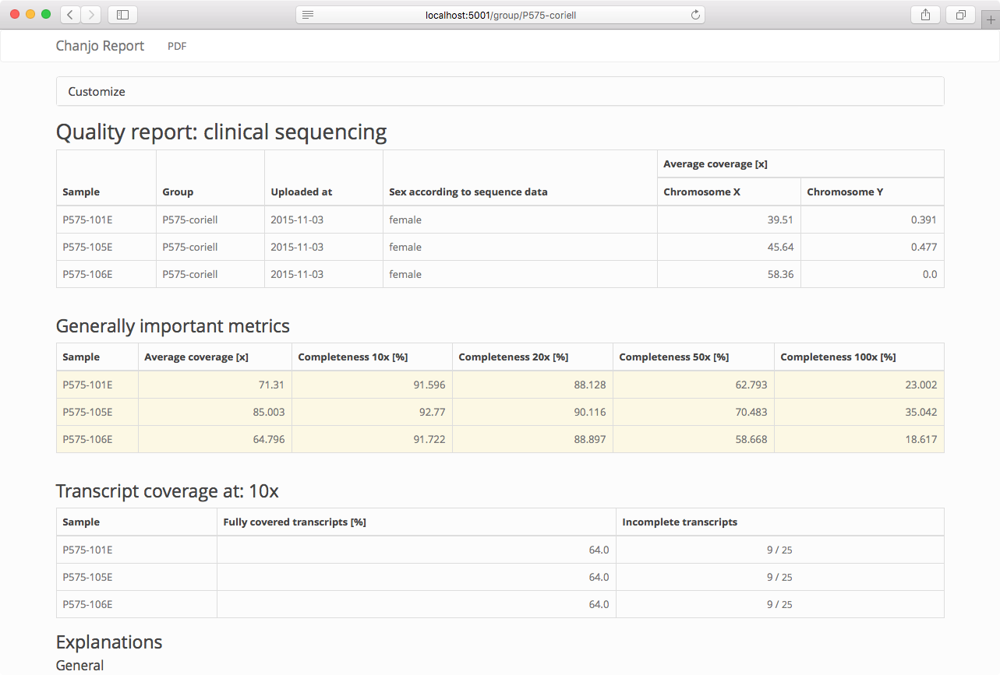

# Chanjo Report [![PyPI version][fury-image]][fury-url] [![Build Status][travis-image]][travis-url]
Automatically generate basic coverage reports from Chanjo SQL databases. This plugin installs as a subcommand ("report") to the Chanjo command line interface.

## Usage
Chanjo Report supports a number of output formats: tabular, PDF, and HTML. To print a PDF coverage report for a group of samples "WGS-prep" do:

```bash
$ chanjo report --render pdf --group "WGS-prep" > ./coverage-report.pdf
```

## Features

### Supported output formats
Chanjo Reports multiple output formats:

  - tabular: easily parsable and pipeable
  - PDF: easily distributable (for humans)
  - HTML: easily deliverable on the web

### Supported languages (translations)
The coverage report (HTML/PDF) can be render is the following languages:

  - English
  - Swedish


## Motivation
We are using the output from Chanjo at Clincal Genomics to report success of sequencing across the exome based on coverage. Our customers, clinicians mostly, are specifically interested in knowing to what degree their genes of interest are covered by sequencing along with some intuitive overall coverage metrics. They want the output in PDF format to file it in their system.

As a side effect of finding it easiest to convert HTML to PDF, Chanjo Report has a built in Flask server that can be used to render reports dynamically and even be plugged into other Flask servers as a Blueprint.


### Installation
Chanjo Report is distributed through pip. Install the latest release by running:

```bash
$ pip install chanjo-report
```

... or locally for development:

```bash
$ git clone https://github.com/robinandeer/chanjo-report.git
$ cd chanjo-report
$ pip install --editable .
```

> Note that I will eventually provide a fully provisioned Vagrant environment to ease development setup :smiley:


## License
MIT. See the [LICENSE](LICENSE) file for more details.


## Contributing
Anyone can help make this project better - read [CONTRIBUTING](CONTRIBUTING.md) to get started!


[fury-url]: http://badge.fury.io/py/chanjo-report
[fury-image]: https://badge.fury.io/py/chanjo-report.png

[travis-url]: https://travis-ci.org/robinandeer/chanjo-report
[travis-image]: https://img.shields.io/travis/robinandeer/chanjo-report.svg?style=flat
