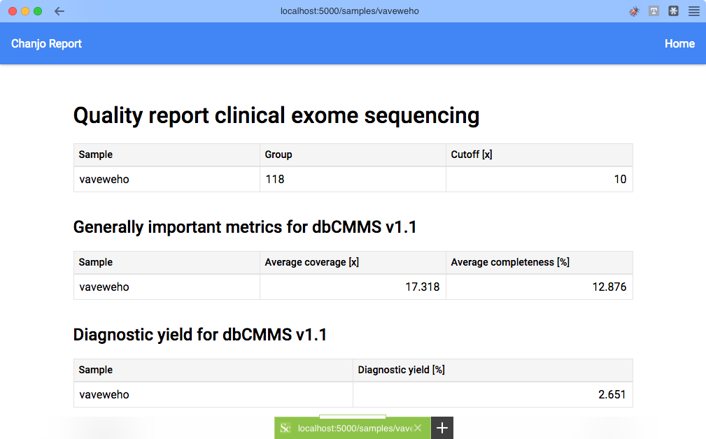

# Chanjo Report [![PyPI version][fury-image]][fury-url] [![Build Status][travis-image]][travis-url]



## Purpose
Chanjo Report automatically generates basic coverage reports from Chanjo SQL databases. It works as a plugin to Chanjo by adding a subcommand to the CLI.


## Features
- Supported input
  - Chanjo SQL database

- Supported output formats
  - text: easily parsable and pipeable
  - PDF: easily distributable (for humans)
  - json: easily transferrable (over networks)
  - HTML: easily deliverable on the web

- Translations/languages
  - English
  - (Swedish)


## Motivation
We are using the output from Chanjo at Clincal Genomics to report success of sequencing across the exome based on coverage. Our customers, clinicians mostly, are specifically interested in knowing to what degree their genes of interest are covered by sequencing along with some intuitive overall coverage metrics. They want the output in PDF format to file it in their system.

As a side effect of finding it easiest to convert HTML to PDF, Chanjo Report has a built in Flask server that can be used to render reports dynamically and even be plugged into other Flask servers as a Blueprint.


## Development
A "manage.py" file is used for development. The server can also be spun up using ``python -m chanjo_report`` but must then disable the reloader since it doesn't play nice with relative imports.

```bash
$ python manage.py runserver -r --debug --host=0.0.0.0
```

### Install
Especially the PDF generation requires a bunch of more or less obscure non-Python dependencies. This demands detailed and robust installation instructions. I will set up a Vagrantfile to provision a fully functional box for development, testing, and demo purposes.

Start by installing Python on Ubuntu by following [these instructions](http://askubuntu.com/questions/101591/how-do-i-install-python-2-7-2-on-ubuntu).

Setup Ubuntu by installing non-Python dependencies.

```bash
$ sudo apt-get install libcairo2 libpango1.0-0 libgdk-pixbuf2.0-0 libffi-dev shared-mime-info
```

Clone the repository and install it for development.

```bash
$ git clone https://github.com/robinandeer/chanjo-report.git
$ cd chanjo-report
$ pip install --editable .
```


## Contributing
Anyone can help make this project better - read [CONTRIBUTION][CONTRIBUTION.md] to get started!


## License
MIT. See the [LICENSE](LICENSE) file for more details.


[fury-url]: http://badge.fury.io/py/chanjo-report
[fury-image]: https://badge.fury.io/py/chanjo-report.png

[travis-url]: https://travis-ci.org/robinandeer/chanjo-report
[travis-image]: https://travis-ci.org/robinandeer/chanjo-report.png?branch=develop
